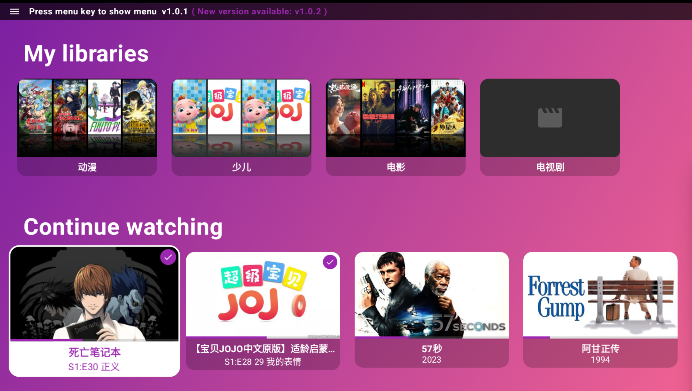
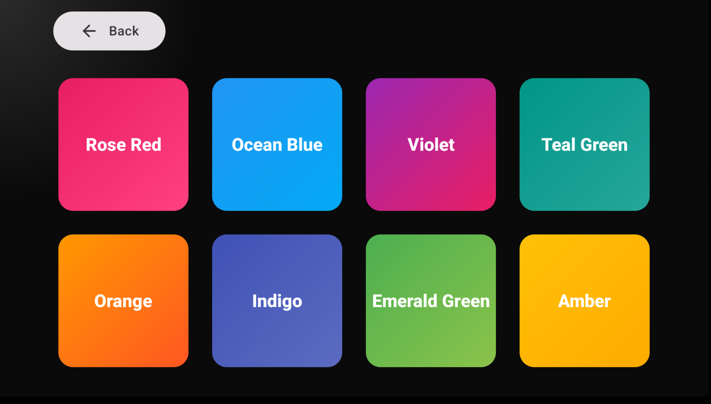

# Emby TV 客户端 / Emby TV Client

简体中文 | English

---

## 简介 / Introduction

这是一个用于学习和技术交流的开源 Emby 客户端（TV/盒子向界面）。
项目主要用于学习 Android 在 TV/遥控交互、焦点管理、流式播放集成（Emby API）以及多语言本地化等方面的实践。

This is an open-source Emby client aimed at learning and exchanging technical knowledge. The project demonstrates Android usage for TV/remote UI, focus handling, streaming integration with Emby API, and localization.

 ## 下载 / Download

 最新版本 / Newest release: v2.0.10

 [Android apk release](https://github.com/shareven/emby_tv/releases/)

 

## 特性 / Features

- 支持 TV/遥控器焦点与按键交互
- 播放器（支持直接播放与转码信息展示）
- 选集与剧集导航（Series/Episodes）
- 简中/英文本地化（跟随系统语言）
- 扫码录入登录信息
- 支持硬解播放4k DHR视频，硬解失败时自动调用服务器转码播放，服务器硬件加速时显示⚡️
- 支持多种主题色选择
- 首页展示收藏列表
- 搜索功能，支持多服务器多帐号的融合搜索
- 支持跳过片头
- 支持缓冲设置
- 支持杜比视界硬解，显示杜比视界相关信息
- 支持更多音频本地ffmpeg解码（"flac", "alac", "pcm_mulaw", "pcm_alaw", "mp3", "aac", "ac3", "eac3", "dca", "mlp", "truehd"）

- Focus and key handling for TV remotes
- Player with direct stream/transcode info
- Series / Episodes navigation
- Localization: Simplified Chinese and English (follows system locale)
- Scan QR code to enter login information 
- Supports hardware decoding of 4K HDR video; if hardware decoding fails, it automatically switches to server-side transcoding for playback.  A lightning bolt icon (⚡️) is displayed when server-side hardware acceleration is active.
- Supports multiple theme color options 
- Displays a favorites list on the homepage
- Search function: Supports integrated searching across multiple servers and accounts. 
- Skip Intro: Supports skipping opening credits/intros. 
- Buffer settings support
- Supports Dolby Vision hardware decoding, displays Dolby Vision related information
- Supports more audio local ffmpeg decoding ("flac", "alac", "pcm_mulaw", "pcm_alaw", "mp3", "aac", "ac3", "eac3", "dca", "mlp", "truehd")

## 展示 / Show

### 首页 / Home Screen

### 主题色选择 / Multiple theme color options

## 本地化 / Localization

本项目在 `app/src/main/res/values-zh/strings.xml`和 `app/src/main/res/values/strings.xml` 中维护中/英文本，界面会根据系统语言自动选择。若要新增翻译，请在该文件中添加键。

This project maintains Chinese and English text in `app/src/main/res/values-zh/strings.xml` and `app/src/main/res/values/strings.xml`, respectively. The user interface will automatically select the appropriate language based on the system language. To add new translations, please add the corresponding keys to these files.

## 播放流程 / Playback Flow

### 1. 播放初始化 / Playback Initialization
用户点击播放 → 调用播放信息接口 → 设置播放器 → 开始播放
User clicks play → Call playback info API → Setup player → Start playback

### 2. 播放状态上报 / Playback Status Reporting
播放开始 → 注册会话 → 定期上报进度 → 播放结束
Playback starts → Register session → Periodic progress reports → Playback ends

### 3. 错误处理与转码管理 / Error Handling & Transcoding Management
播放失败 → 自动转码回退 → 重试机制
Playback fails → Auto transcode fallback → Retry mechanism

**转码服务管理**：
- 轨道切换时：检测到转码URL存在则停止之前的转码任务
- 数据加载时：确保没有残留的转码任务在运行
- Track switching: Stop previous transcoding if transcoding URL exists
- Data loading: Ensure no residual transcoding tasks are running

### 4. 用户交互 / User Interaction
轨道切换、进度控制、屏幕常亮
Track switching, progress control, keep screen on

### 外部服务 / External Services
- `GET https://api.github.com/repos/shareven/emby_tv/releases/latest` - 获取最新版本信息 / Get latest version info

## 贡献与交流 / Contributing

欢迎通过 Issues 或 PR 交流问题与改进想法。此项目以学习交流为主，代码风格可能更偏向演示与实践用途。

Please open Issues or PRs for bugs or improvements. This project is primarily for learning and technical exchange, and code may be organized for demonstration purposes.

## 许可 / License

本项目使用禁止商业用途的许可：Creative Commons Attribution-NonCommercial 4.0 International (CC BY-NC 4.0)。

简要说明：允许复制、分发和改编，但禁止用于商业用途，使用时需注明作者并链接到许可协议。

This project uses a non-commercial license: Creative Commons Attribution-NonCommercial 4.0 International (CC BY-NC 4.0).

summary: You are free to copy, distribute, and adapt the work, as long as you don't use it for commercial purposes. When you do, you must attribute the work and include a link to the license.

许可证原文与条款请见 / License Text and Terms :

https://creativecommons.org/licenses/by-nc/4.0/legalcode

SPDX-License-Identifier: CC-BY-NC-4.0
